 

  

  

 

info:

<table border="0">
<tr>
<td width="60%" valign="top">

I develop absolutely **incredible** things—specifically, creative projects. My work covers everything from frontend and backend development to integrating your custom bots and scripts. If you are familiar with my projects—or if something you’ve just seen caught your eye—and you have an idea, please get in touch. Contact me via the links below.

</td>
<td width="50%" valign="top" align="center">

</td>
</tr>
</table>

  

 
  
  tech stack:

         
   
         

 

  

Connect With Me

